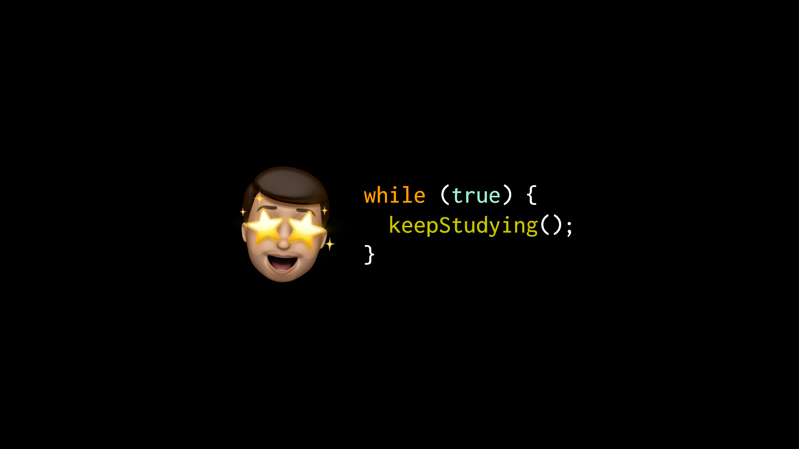

## 📚 Jornada de Estudos

Decidi mudar de carreira e comecei a estudar programação! 💻

Esse repositório nasceu para registrar infomações relevantes sobre tecnologias que já estudei ou estou estudando. 
Espero que algumas dessas anotações ajudem outras pessoas também. Caso encontre alguma informação imprecisa, por favor, entre em contato comigo.

### Frentes de estudo

| Nome       | Descrição                                                                                                               | Anotações  |
|:------------:|-------------------------------------------------------------------------------------------------------------------------|:------------:|
| HTML       | Hyper Text Markup Language é uma linguagem de marcação que domina a os portais da internet.                             | Em construção  |
| CSS        | A Cascading Style Sheet é a linguagem para estilização de páginas.                                                      | Em construção  |
| Javascript | A linguagem de programação que nasceu para navegadores, mas que atualmente permeia vários ambientes de desenvolvimento. | [Veja aqui](https://github.com/leottx/jornada-webdev/blob/master/javascript/javascript.md)  |
| Git        | Trata-se de um Sistema de Controle de Versões (VCS) para desenvolvimento de software.                                   | Em construção  |